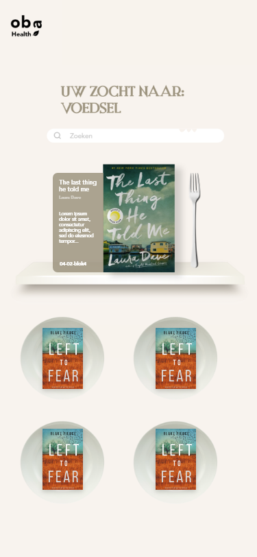
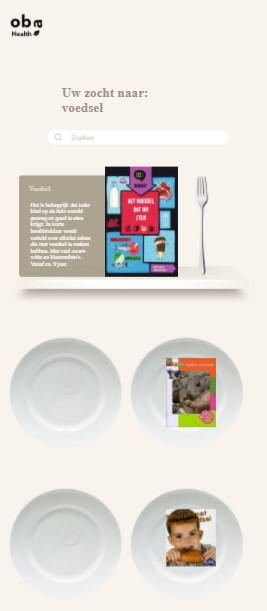

# OBA Project-1 📕

[ 📕 Live link naar product](https://Fabienne02.github.io/OBA/index.html)

# Introduction
Voor de OBA heb ik een applicatie ontworpen. Hierbij heb ik als doelgroep + Userstory genomen: <i>Voeding en diëtiek</i>
Hierbij wilde ik een omgeving ontwerpen waarbij het interface zo vriendelijk mogelijk was ingericht voor mensen met interesse in voeding. 
Ook streefde ik naar een uiterlijk dat afwijkte van de standaard lijst interface die je vaak terug ziet in bibliotheken.




## Table of contents
  - [Table of contents](#table-of-contents)
  - [Introduction](#introduction)
  - [About](#about)
  - [Gecodeerd met](#gecodeerd-met)
  - [Features](#features)
  - [Wishlist](#wishlist)
  - [Installing](#installing)
  - [Sources](#sources)
  - [Author](#author)

## About
**Een boekenzoeker speciaal ingericht voor voedings informatie**
Deze applicatie maakt gebruik van een api: [OBA Api](https://zoeken.oba.nl/api/v1/search/?q=%22voeding%22&refine=true&authorization=16c19e6083308c984c452600134989ba&sort=act_dt_asc&output=json)

Deze api staat vol met boeken en kan gebruikt worden om te filteren en specafieke catogorien te tonen. 
De api vereist een aanvraag van tijdelijk toegang met deze [link](https://cors-anywhere.herokuapp.com/corsdemo)
En de bijbehoorende api key.
Maak zelfs gebruik van deze api met deze [start code](https://github.com/cmda-minor-web/project-1-2021/blob/main/example/oba-api/static/js/app.js)

## Gecodeerd met
Deze applicatie is gecodeerd in HTML, CSS en Javascript

## Features
<ul>
  <li>Klik op jouw boek van interesse om meer te weten te komen</li>
</ul>

## Wishlist
<ul>
  <li>Hover interacties voor een speelse inrichting</li>
  <li>Werkende zoekbalk</li>
  <li>Informatie over sport en voeding</li>
</ul>

## Installing
1. Clone deze repository naar jouw lokale folder
```
git clone https://github.com/Fabienne02/OBA.git
```
2. Open de folder in jouw code applicatie [Zoals VSCODE](https://code.visualstudio.com/Download)
3. Start een live port en bekijk het project in jouw browser

## Sources
- [OBA API](https://zoeken.oba.nl/api/v1/search/?q=%22voeding%22&refine=true&authorization=16c19e6083308c984c452600134989ba&sort=act_dt_asc&output=json)
- [Code hulp bron](https://developer.mozilla.org/en-US/)


## Author
De maker van deze app is: [*Fabienne van den Steen*](https://github.com/Fabienne02)


